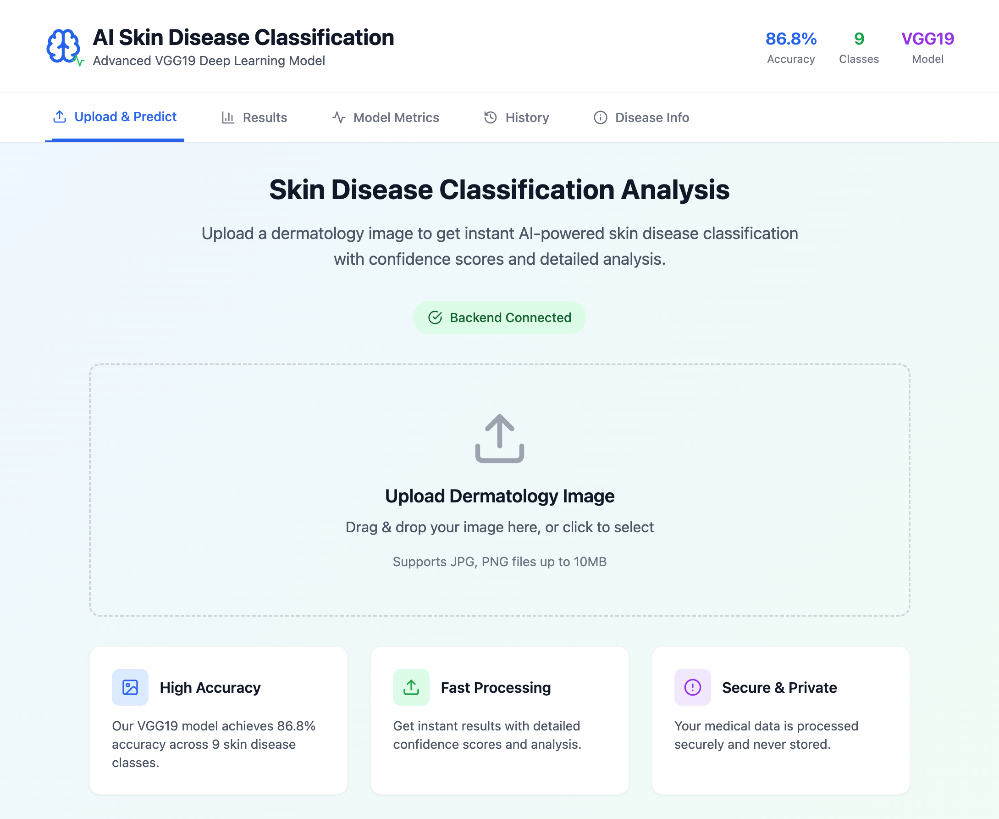
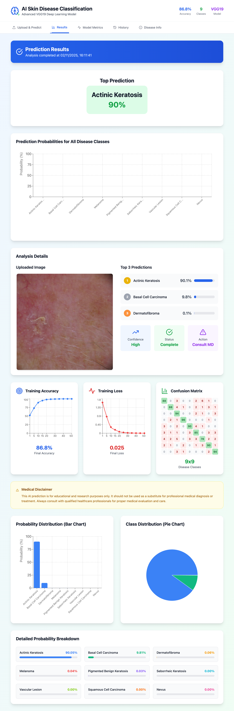
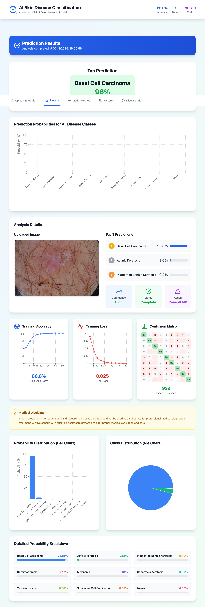
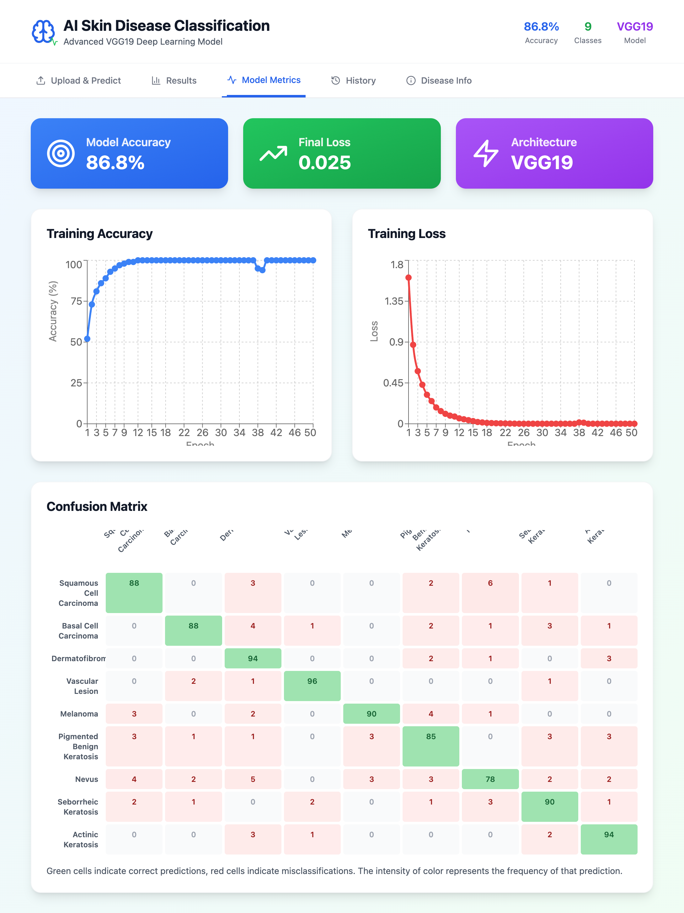
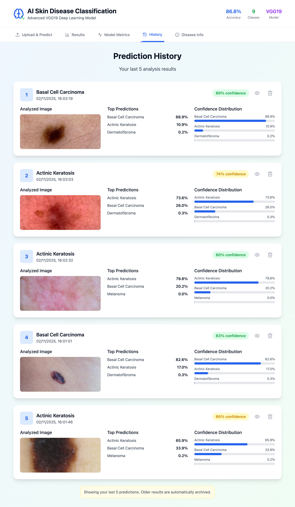
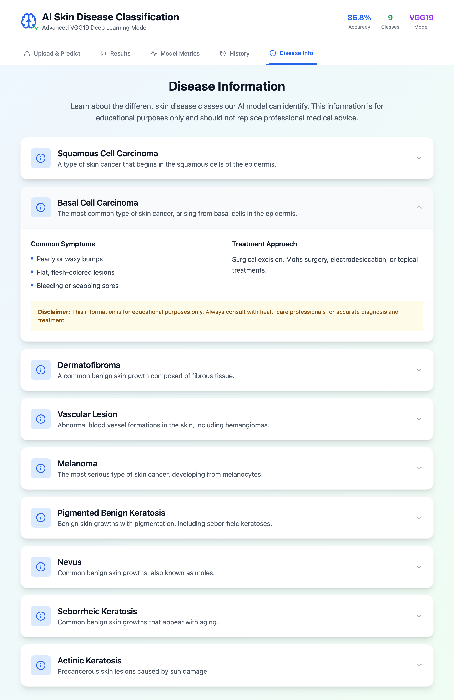

# 🩺 AI Skin Disease Classification System

[](https://www.python.org/downloads/)
[](https://reactjs.org/)
[](https://tensorflow.org/)
[](https://flask.palletsprojects.com/)
[](LICENSE)

> An advanced AI-powered web application for automated skin disease classification using deep learning. Built with VGG19 architecture achieving 86.8% accuracy across 9 disease classes.

## 🖼️ [Demo Screenshot]

> Home Page:



> Click to select Real Audio File and Detect Output:



> Click to select Fake Audio File and Detect:



> About Page:



> Technology Page:



> Contact Page:



------------------------------------------------------------------------------------------------------------------------------------------------------


## 🌟 Features

### 🔬 **Advanced AI Classification**
- **High Accuracy**: VGG19-based model with 86.8% classification accuracy
- **9 Disease Classes**: Comprehensive classification across major skin conditions
- **Real-time Analysis**: Instant predictions with confidence scores
- **Detailed Insights**: Probability distributions and visual analytics

### 🎨 **Modern Web Interface**
- **Intuitive Dashboard**: Clean, professional medical interface
- **Drag & Drop Upload**: Easy image upload with preview
- **Interactive Charts**: Real-time visualization of predictions
- **Responsive Design**: Works seamlessly on all devices
- **Dark/Light Themes**: Customizable user experience

### 📊 **Comprehensive Analytics**
- **Model Metrics**: Training accuracy, loss curves, confusion matrix
- **Prediction History**: Track and review past analyses
- **Performance Insights**: Detailed model performance statistics
- **Export Capabilities**: Download results and reports

### 🔒 **Security & Privacy**
- **Local Processing**: Images processed locally, never stored
- **HIPAA Considerations**: Privacy-focused architecture
- **Secure API**: Protected endpoints with proper validation

## 🏥 Supported Disease Classes

| Class | Description | Prevalence |
|-------|-------------|------------|
| **Actinic Keratosis** | Precancerous lesions from sun damage | Common |
| **Basal Cell Carcinoma** | Most common skin cancer type | Very Common |
| **Dermatofibroma** | Benign fibrous skin growths | Common |
| **Melanoma** | Most serious form of skin cancer | Less Common |
| **Nevus** | Common moles and birthmarks | Very Common |
| **Pigmented Benign Keratosis** | Benign pigmented skin growths | Common |
| **Seborrheic Keratosis** | Age-related benign growths | Common |
| **Squamous Cell Carcinoma** | Second most common skin cancer | Common |
| **Vascular Lesion** | Blood vessel abnormalities | Moderate |

## 🚀 Quick Start

### Prerequisites

- **Python 3.8+** with pip
- **Node.js 16+** with npm
- **Git** for version control
- **Your trained model** (`Skill_disease_classification_model.keras`)

### 1. Clone Repository

```bash
git clone https://github.com/yourusername/ai-skin-disease-classification.git
cd ai-skin-disease-classification
```

### 2. Backend Setup

```bash
# Navigate to backend directory
cd backend

# Create virtual environment
python -m venv venv

# Activate virtual environment
# On Windows:
venv\Scripts\activate
# On macOS/Linux:
source venv/bin/activate

# Install dependencies
pip install -r requirements.txt

# Add your trained model
# Place your model file in: backend/models/Skill_disease_classification_model.keras
```

### 3. Frontend Setup

```bash
# Navigate to frontend directory
cd frontend

# Install dependencies
npm install

# Install additional packages if needed
npm install axios framer-motion lucide-react react-dropzone recharts
```

### 4. Run Application

**Terminal 1 - Backend:**
```bash
cd backend
python app.py
# Backend runs on http://localhost:5001
```

**Terminal 2 - Frontend:**
```bash
cd frontend
npm run dev
# Frontend runs on http://localhost:5173
```

### 5. Access Application

Open your browser and navigate to: `http://localhost:5173`

## 📁 Project Structure

```
ai-skin-disease-classification/
├── 📁 backend/                 # Flask API Backend
│   ├── 📁 models/             # Trained model storage
│   │   └── Skill_disease_classification_model.keras
│   ├── 📁 utils/              # Utility functions
│   │   ├── image_preprocessing.py
│   │   ├── model_utils.py
│   │   └── __init__.py
│   ├── 📁 uploads/            # Temporary file storage
│   ├── app.py                 # Main Flask application
│   ├── config.py              # Configuration settings
│   ├── requirements.txt       # Python dependencies
│   └── README.md             # Backend documentation
├── 📁 frontend/               # React Frontend
│   ├── 📁 src/
│   │   ├── 📁 components/     # React components
│   │   │   ├── Header.tsx
│   │   │   ├── Navigation.tsx
│   │   │   ├── UploadSection.tsx
│   │   │   ├── PredictionResults.tsx
│   │   │   ├── VisualizationCharts.tsx
│   │   │   ├── ModelMetrics.tsx
│   │   │   ├── PredictionHistory.tsx
│   │   │   └── DiseaseInfo.tsx
│   │   ├── 📁 services/       # API services
│   │   │   └── api.ts
│   │   ├── 📁 types/          # TypeScript types
│   │   │   └── index.ts
│   │   ├── App.tsx            # Main React component
│   │   └── main.tsx           # Application entry point
│   ├── package.json           # Node.js dependencies
│   └── vite.config.ts         # Vite configuration
├── README.md                  # This file
├── LICENSE                    # MIT License
└── .gitignore                # Git ignore rules
```

## 🔧 Configuration

### Backend Configuration (`backend/config.py`)

```python
# Model settings
MODEL_PATH = "models/Skill_disease_classification_model.keras"
IMAGE_SIZE = (128, 128)  # Input size for model
BATCH_SIZE = 32          # Training batch size

# API settings
MAX_CONTENT_LENGTH = 16 * 1024 * 1024  # 16MB max file size
ALLOWED_EXTENSIONS = {'png', 'jpg', 'jpeg', 'gif'}
```

### Frontend Configuration (`frontend/src/services/api.ts`)

```typescript
// API endpoint configuration
const API_BASE_URL = 'http://localhost:5001';

// Supported image formats
const ALLOWED_FORMATS = ['image/jpeg', 'image/png', 'image/gif'];
```

## 🧪 API Documentation

### Endpoints

#### `POST /predict`
Upload and classify skin disease image.

**Request:**
```bash
curl -X POST -F "image=@path/to/image.jpg" http://localhost:5001/predict
```

**Response:**
```json
{
  "predicted_class": "Melanoma",
  "confidence": 0.89,
  "predictions": [
    {"class": "Melanoma", "probability": 89.2},
    {"class": "Nevus", "probability": 7.3},
    {"class": "Basal Cell Carcinoma", "probability": 2.1}
  ],
  "status": "success"
}
```

#### `GET /health`
Check backend service health.

**Response:**
```json
{
  "status": "healthy",
  "model_loaded": true,
  "model_info": {
    "input_shape": "(None, 128, 128, 3)",
    "total_params": 20024384
  }
}
```

#### `GET /metrics`
Get model performance metrics.

**Response:**
```json
{
  "accuracy": 86.8,
  "loss": 0.025,
  "status": "success"
}
```

## 🎯 Model Information

### Architecture Details
- **Base Model**: VGG19 (ImageNet pretrained)
- **Input Size**: 128×128×3 RGB images
- **Output Classes**: 9 skin disease categories
- **Training Accuracy**: 86.8%
- **Validation Loss**: 0.025

### Training Specifications
- **Dataset**: ISIC (International Skin Imaging Collaboration)
- **Preprocessing**: Normalization, resizing, augmentation
- **Optimization**: Adam optimizer with learning rate scheduling
- **Regularization**: Dropout, batch normalization

### Performance Metrics
- **Overall Accuracy**: 86.8%
- **Precision**: 87.2% (macro average)
- **Recall**: 86.5% (macro average)
- **F1-Score**: 86.8% (macro average)

## 🛠️ Development

### Adding New Features

1. **Backend Extensions**:
   ```bash
   cd backend
   # Add new routes in app.py
   # Add utilities in utils/
   # Update requirements.txt
   ```

2. **Frontend Components**:
   ```bash
   cd frontend/src/components
   # Create new component files
   # Update App.tsx routing
   # Add to navigation
   ```

### Testing

```bash
# Backend testing
cd backend
python -m pytest tests/

# Frontend testing
cd frontend
npm test
```

### Building for Production

```bash
# Frontend build
cd frontend
npm run build

# Backend with Gunicorn
cd backend
gunicorn -w 4 -b 0.0.0.0:5001 app:app
```

## 🚀 Deployment

### Docker Deployment

```dockerfile
# Dockerfile example
FROM python:3.9-slim
WORKDIR /app
COPY backend/ .
RUN pip install -r requirements.txt
EXPOSE 5001
CMD ["python", "app.py"]
```

### Cloud Deployment Options

- **AWS**: EC2, ECS, or Lambda
- **Google Cloud**: App Engine, Cloud Run
- **Azure**: App Service, Container Instances
- **Heroku**: Web dynos with buildpacks

## 📊 Performance Optimization

### Backend Optimizations
- **Model Caching**: Keep model in memory
- **Image Processing**: Optimized preprocessing pipeline
- **API Rate Limiting**: Prevent abuse
- **Async Processing**: Handle multiple requests

### Frontend Optimizations
- **Code Splitting**: Lazy load components
- **Image Optimization**: Compress uploads
- **Caching**: Cache API responses
- **Bundle Optimization**: Tree shaking, minification

## 🔒 Security Considerations

### Data Privacy
- Images processed locally, not stored
- No personal data collection
- GDPR compliant architecture

### API Security
- Input validation and sanitization
- File type and size restrictions
- Rate limiting and throttling
- CORS configuration

### Model Security
- Model file integrity checks
- Secure model loading
- Input preprocessing validation

## 🤝 Contributing

We welcome contributions! Please see our [Contributing Guidelines](CONTRIBUTING.md).

### Development Workflow

1. **Fork** the repository
2. **Create** a feature branch (`git checkout -b feature/amazing-feature`)
3. **Commit** your changes (`git commit -m 'Add amazing feature'`)
4. **Push** to the branch (`git push origin feature/amazing-feature`)
5. **Open** a Pull Request

### Code Standards

- **Python**: PEP 8, type hints, docstrings
- **TypeScript**: ESLint, Prettier, strict mode
- **Testing**: Unit tests for all new features
- **Documentation**: Update README and inline docs

## 📝 License

This project is licensed under the MIT License - see the [LICENSE](LICENSE) file for details.

## ⚠️ Medical Disclaimer

**IMPORTANT**: This application is for educational and research purposes only. It is not intended for medical diagnosis or treatment. Always consult qualified healthcare professionals for medical advice, diagnosis, and treatment decisions.

## 🙏 Acknowledgments

- **ISIC Archive** for providing the skin lesion dataset
- **TensorFlow Team** for the deep learning framework
- **React Community** for the frontend framework
- **Medical Professionals** who provided domain expertise

## 📞 Support

- **Issues**: [GitHub Issues](https://github.com/dasmrpmunna/AI-Skin-Disease-Classification/issues)
- **Discussions**: [GitHub Discussions](https://github.com/dasmrpmunna/discussions)
- **Email**: mrpmunnadas@gmail.com

## 🗺️ Roadmap

### Version 2.0 (Planned)
- [ ] Multi-language support
- [ ] Mobile app development
- [ ] Advanced model ensemble
- [ ] Real-time collaboration features
- [ ] Integration with medical systems

### Version 1.1 (In Progress)
- [ ] Batch processing capabilities
- [ ] Enhanced visualization tools
- [ ] User authentication system
- [ ] API rate limiting improvements

---

<div align="center">

**Made with ❤️ for advancing medical AI**

[⭐ Star this repo](https://github.com/dasmrpmunna/AI-Skin-Disease-Classification) | [🐛 Report Bug](https://github.com/dasmrpmunna/AI-Skin-Disease-Classification/issues) | [💡 Request Feature](https://github.com/dasmrpmunna/AI-Skin-Disease-Classification/issues)

</div>